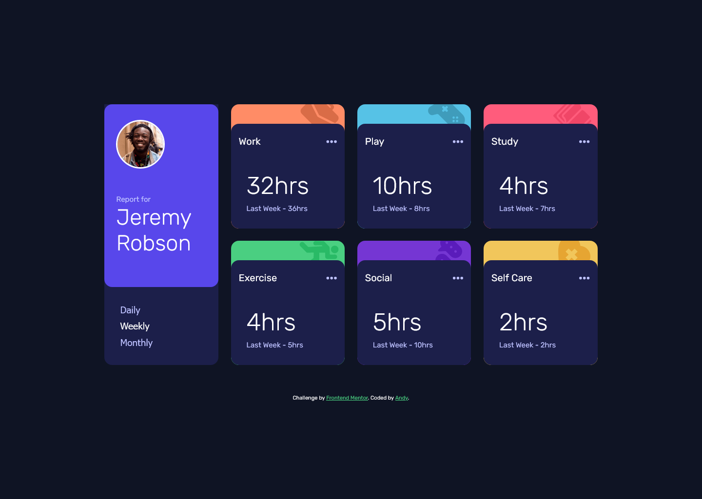
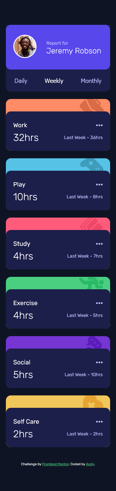

# Frontend Mentor - Time tracking dashboard solution

This is a solution to the [Time tracking dashboard challenge on Frontend Mentor](https://www.frontendmentor.io/challenges/time-tracking-dashboard-UIQ7167Jw). Frontend Mentor challenges help you improve your coding skills by building realistic projects.

## Table of contents

- [Overview](#overview)
  - [The challenge](#the-challenge)
  - [Screenshot](#screenshot)
  - [Links](#links)
- [My process](#my-process)
  - [Built with](#built-with)
- [Author](#author)

## Overview

This is my 18th challenge from [Front-end-mentor.io](https://www.frontendmentor.io/). It was to code and style a stat tracker dashboard based on the design assets provided. (static **JPG** images).

### The challenge

Users should be able to:

- View the optimal layout for the site depending on their device's screen size
- See hover states for all interactive elements on the page
- Switch between viewing Daily, Weekly, and Monthly stats

### Screenshot

### Links

- Solution URL: [GitHub Repo](https://github.com/AndyAshley/front-end-mentor/tree/advice-generator-app)
- Live Site URL: [Netlify Page](https://dainty-pithivier-f4e9d3.netlify.app/)

## My process

### Built with

- Semantic HTML5 markup
- CSS custom properties
- Flexbox
- CSS Grid
- Mobile-first workflow
- Javascript
- JSON data

## Author

- Frontend Mentor - [@Andy](https://www.frontendmentor.io/profile/AndyAshley)
