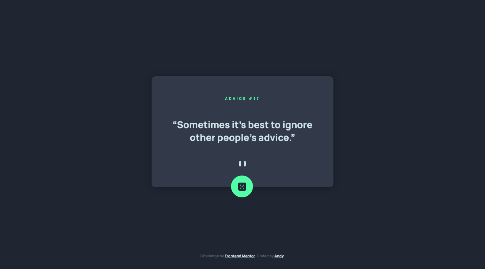
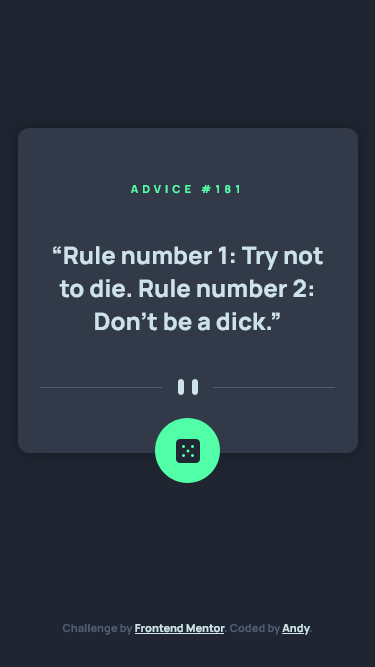

# Frontend Mentor - Advice generator app solution

This is a solution to the [Advice generator app challenge on Frontend Mentor](https://www.frontendmentor.io/challenges/advice-generator-app-QdUG-13db). Frontend Mentor challenges help you improve your coding skills by building realistic projects.

## Table of contents

- [Overview](#overview)
  - [The challenge](#the-challenge)
  - [Screenshot](#screenshot)
  - [Links](#links)
- [My process](#my-process)
  - [Built with](#built-with)
  - [What I learned](#what-i-learned)
  - [Continued development](#continued-development)
  - [Useful resources](#useful-resources)
- [Author](#author)
- [Acknowledgments](#acknowledgments)

**Note: Delete this note and update the table of contents based on what sections you keep.**

## Overview

This is my 17th challenge from [Front-end-mentor.io](https://www.frontendmentor.io/). It was to code and style an advice generating app that pulls a random "slip" from the [Advice Slip API](https://api.adviceslip.com/) based on the design assets provided. (static **JPG** images).

### The challenge

Users should be able to:

- Get random useful or quirky advice

### Screenshot

### Links

- Solution URL: [GitHub Repo](https://github.com/AndyAshley/front-end-mentor/tree/advice-generator-app)
- Live Site URL: [Netlify Site](https://melodic-valkyrie-a3eb52.netlify.app/)

## My process

### Built with

- Semantic HTML5 markup
- CSS custom properties
- Flexbox
- SCSS
- Mobile-first workflow
- Javascript

## Author

- Frontend Mentor - [@Andy](https://www.frontendmentor.io/profile/AndyAshley)
