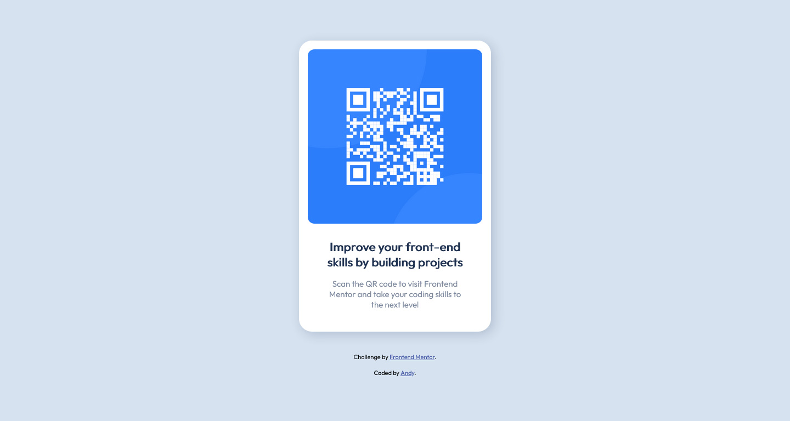

# Frontend Mentor - QR code component solution

This is a solution to the [QR code component challenge on Frontend Mentor](https://www.frontendmentor.io/challenges/qr-code-component-iux_sIO_H). Frontend Mentor challenges help you improve your coding skills by building realistic projects.

## Table of contents

- [Overview](#overview)
  - [Screenshot](#screenshot)
  - [Links](#links)
- [My process](#my-process)
  - [Built with](#built-with)
  - [What I learned](#what-i-learned)
- [Author](#author)

**Note: Delete this note and update the table of contents based on what sections you keep.**

## Overview

My first challenge with [Frontendmentor.io](https://www.frontendmentor.io/challenges). It was to code and style a QR card component based on the design assets provided.

### Screenshot

### Links

- Solution URL: [GitHub Repo](https://github.com/AndyAshley/front-end-mentor/tree/qr-challenge)
- Live Site URL: [GitHub Pages](https://andyashley.github.io/front-end-mentor/)

## My process

I started with laying out the HTML stucture of the card, writing easily identifiable class names as I went. After I set up the structure, I created a style.css and added a :root for the color variables. I didnt have the **Pro** figma file so I based my styling off of the **JPG** images provided.
It was set up using flexbox so its pretty responsive already, though I did go in and add some media querys for smaller sizes to be safe.

### Built with

- Semantic HTML5 markup
- CSS custom properties
- Flexbox
- Mobile-first workflow

### What I learned

I learned how to set up GitHub pages, and how to submit a solution on [Frontendmentor.io](https://www.frontendmentor.io/) !

## Author

- Frontend Mentor - [@AndyAshley](https://www.frontendmentor.io/profile/AndyAshley)
