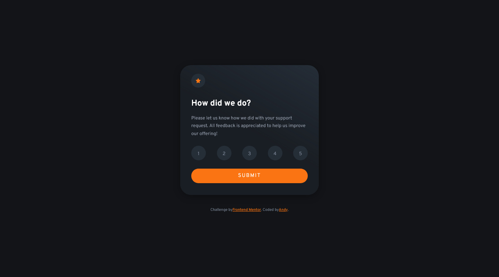

# Frontend Mentor - Interactive rating component solution

This is a solution to the [Interactive rating component challenge on Frontend Mentor](https://www.frontendmentor.io/challenges/interactive-rating-component-koxpeBUmI). Frontend Mentor challenges help you improve your coding skills by building realistic projects.

## Table of contents

- [Overview](#overview)
  - [The challenge](#the-challenge)
  - [Screenshot](#screenshot)
  - [Links](#links)
- [My process](#my-process)
  - [Built with](#built-with)
  - [What I learned](#what-i-learned)
  - [Useful resources](#useful-resources)
- [Author](#author)

## Overview

This is my 14th challenge from [Front-end-mentor.io](https://www.frontendmentor.io/). It was to code and style a rating card component based on the design assets provided. (static **JPG** images)

### The challenge

Users should be able to:

- View the optimal layout for the app depending on their device's screen size
- See hover states for all interactive elements on the page
- Select and submit a number rating
- See the "Thank you" card state after submitting a rating

### Screenshot

### Links

- Solution URL: [GitHub Repo](https://github.com/AndyAshley/front-end-mentor/tree/interactive-rating-component)
- Live Site URL: [Netlify Page](https://boring-euler-872aeb.netlify.app/)

## My process

### Built with

- Semantic HTML5 markup
- CSS custom properties
- Flexbox
- Mobile-first workflow
- Javascript

### What I learned

I learned more about CSS transform rotate with preserve 3d and perspective. I wanted to do something more from a **UI/UX** perspective when a user submitted a rating.

### Useful resources

- [W3 schools flip card](https://www.w3schools.com/howto/howto_css_flip_card.asp) - This helped me figure out the transition that I wanted to make on a successful submit.

## Author

- Frontend Mentor - [@Andy](https://www.frontendmentor.io/profile/AndyAshley)
