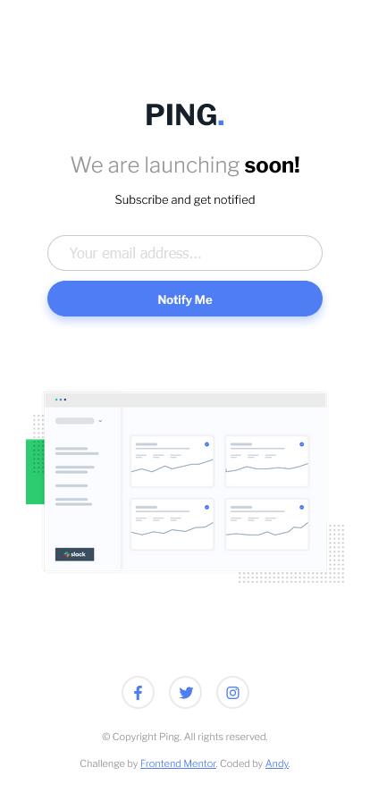

# Frontend Mentor - Ping coming soon page solution

This is a solution to the [Ping coming soon page challenge on Frontend Mentor](https://www.frontendmentor.io/challenges/ping-single-column-coming-soon-page-5cadd051fec04111f7b848da). Frontend Mentor challenges help you improve your coding skills by building realistic projects.

## Table of contents

- [Overview](#overview)
  - [The challenge](#the-challenge)
  - [Screenshot](#screenshot)
  - [Links](#links)
- [My process](#my-process)
  - [Built with](#built-with)
  - [What I learned](#what-i-learned)
- [Author](#author)

**Note: Delete this note and update the table of contents based on what sections you keep.**

## Overview

This is my 15th challenge from [Front-end-mentor.io](https://www.frontendmentor.io/). It was to code and style a coming soon page with email validation based on the design assets provided. (static **JPG** images).

I made a custom Toast for a successful submit to let the user know its all good from a UI/UX standpoint.

### The challenge

Users should be able to:

- View the optimal layout for the site depending on their device's screen size
- See hover states for all interactive elements on the page
- Submit their email address using an `input` field
- Receive an error message when the `form` is submitted if:
  - The `input` field is empty. The message for this error should say _"Whoops! It looks like you forgot to add your email"_
  - The email address is not formatted correctly (i.e. a correct email address should have this structure: `name@host.tld`). The message for this error should say _"Please provide a valid email address"_

### Screenshot




### Links

- Solution URL: [GitHub Repo](https://github.com/AndyAshley/front-end-mentor/tree/single-column-pageg)
- Live Site URL: [Netlify Page](https://cocky-cray-8bfb37.netlify.app/)

## My process

### Built with

- Semantic HTML5 markup
- CSS custom properties
- SCSS
- Custom CSS animations
- Flexbox
- Mobile-first workflow
- Javascript

### What I learned

Proud of this toast even though its super simple. Its better than my last one. Im so used to things like react-toastify that making one on me own was pretty fun.

```js
function createToast(text) {
  //what we want our toast to say, ex. "Success!"
  const message = text;

  // create the element and add the toast class
  const toast = document.createElement("div");
  toast.className = "toast";

  const toastText = document.createElement("p");
  toastText.innerHTML = message;
  toast.appendChild(toastText);
  mainContainer.insertBefore(toast, toastBefore);

  // automatically remove the element after 5s
  setTimeout(() => {
    toast.remove();
  }, 5000);

  // Or remove the element on click
  toast.addEventListener("click", () => {
    toast.remove();
  });
}
```

## Author

- Frontend Mentor - [@Andy](https://www.frontendmentor.io/profile/AndyAshley)
